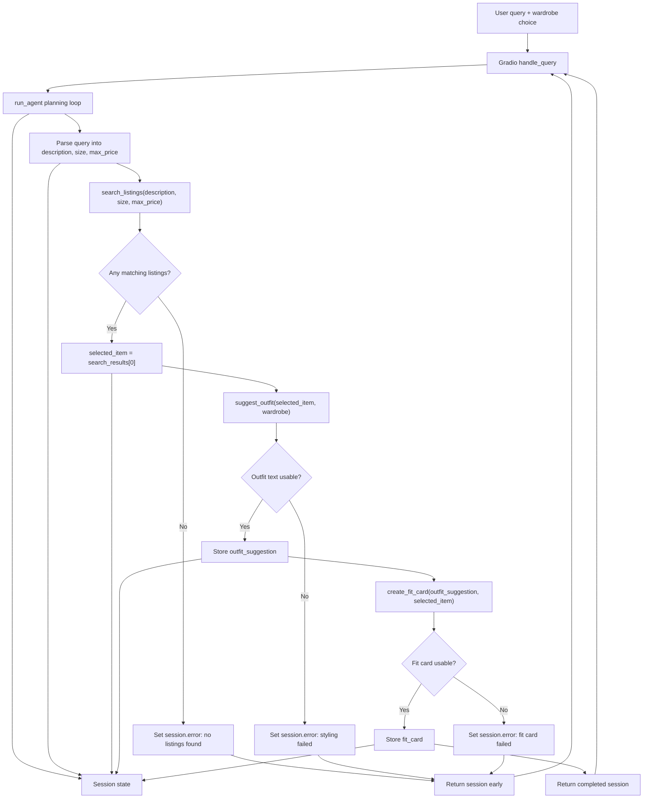

# FitFindr — planning.md

> Complete this document before writing any implementation code.
> Your spec and agent diagram are what you'll use to direct AI tools (Claude, Copilot, etc.) to generate your implementation — the more specific they are, the more useful the generated code will be.
> Your planning.md will be reviewed as part of your submission.
> Update it before starting any stretch features.

---

## Tools

List every tool your agent will use. For each tool, fill in all four fields.
You must have at least 3 tools. The three required tools are listed — add any additional tools below them.

### Tool 1: search_listings

**What it does:**
Searches `data/listings.json` for secondhand listings that match the user's requested item description, optional size, and optional maximum price. It filters out listings that violate hard constraints, scores the remaining listings by keyword/style overlap, and returns the best matches first.

**Input parameters:**
- `description` (str): The item/style the user is looking for, such as `"vintage graphic tee"` or `"black combat boots"`. This is matched against listing titles, descriptions, categories, style tags, colors, brands, and platforms.
- `size` (str | None): The requested size, such as `"M"`, `"US 8"`, or `"W30"`. If `None`, size is not used as a filter. Size matching should be case-insensitive and allow partial matches, because listing sizes may look like `"S/M"` or `"XL (oversized)"`.
- `max_price` (float | None): The user's maximum budget in dollars. If `None`, price is not used as a filter. When provided, only listings with `price <= max_price` should remain.

**What it returns:**
A `list[dict]` of matching listing dictionaries sorted from most relevant to least relevant. Each dictionary comes from the mock dataset and contains `id`, `title`, `description`, `category`, `style_tags`, `size`, `condition`, `price`, `colors`, `brand`, and `platform`.

**What happens if it fails or returns nothing:**
The tool returns an empty list instead of raising an exception. The agent stores that empty result in `session["search_results"]`, sets `session["error"]` to a helpful no-results message with suggestions for loosening the search, and returns early without calling `suggest_outfit` or `create_fit_card`.

---

### Tool 2: suggest_outfit

**What it does:**
Suggests one or two complete outfits that include the selected thrift listing and items from the user's wardrobe. It should use the wardrobe item's categories, colors, style tags, and notes to make the suggestion feel specific instead of generic.

**Input parameters:**
- `new_item` (dict): The selected listing dictionary returned by `search_listings`; it includes fields such as `title`, `category`, `style_tags`, `size`, `price`, `colors`, `brand`, and `platform`.
- `wardrobe` (dict): A wardrobe object with an `items` key. Each item has `id`, `name`, `category`, `colors`, `style_tags`, and optional `notes`.

**What it returns:**
A non-empty `str` with a styling recommendation. For a populated wardrobe, the response should name specific wardrobe pieces and explain how they work with the new item. For an empty wardrobe, the response should give general styling guidance by naming categories of pieces the user could pair with the item.

**What happens if it fails or returns nothing:**
If the wardrobe is empty, the tool should still return useful general styling advice instead of failing. If the LLM call errors or returns blank text, the tool should return a fallback styling sentence based on the new item's category, colors, and style tags so the agent can continue.

---

### Tool 3: create_fit_card

**What it does:**
Creates a short, shareable caption for the complete outfit. It turns the selected thrift listing and outfit suggestion into a casual fit-card style description that mentions the item, platform, price, and overall vibe.

**Input parameters:**
- `outfit` (str): The outfit suggestion returned by `suggest_outfit`.
- `new_item` (dict): The selected listing dictionary returned by `search_listings`.

**What it returns:**
A `str` containing a 2-4 sentence caption suitable for an outfit post. The caption should sound casual, mention the thrifted item naturally, include the price and platform once, and vary across different inputs.

**What happens if it fails or returns nothing:**
If `outfit` is missing, empty, or only whitespace, the tool returns a clear error string such as `"I need an outfit suggestion before I can create a fit card."` If the LLM call fails or returns blank text, the tool returns a simple fallback caption using the item title, price, platform, and a short description of the outfit.

---

### Additional Tools (if any)

No additional tools for the required implementation. I will finish and test the three required tools before adding any stretch features.

---

## Planning Loop

**How does your agent decide which tool to call next?**
The agent runs one interaction through a session dictionary and advances only when the previous step produced valid data.

1. Create a new session with `_new_session(query, wardrobe)`.
2. Parse the user query into `description`, `size`, and `max_price`, then store those values in `session["parsed"]`. I will use deterministic parsing: regex for prices like `under $30`, simple pattern matching for sizes like `size M`, `US 8`, or `W30`, and the remaining cleaned text as the description.
3. Call `search_listings(description, size, max_price)` and store the returned list in `session["search_results"]`.
4. If `session["search_results"]` is empty, set `session["error"]` to a no-results message and return the session immediately. The loop stops here because there is no `new_item` to style.
5. If results exist, choose the first result as `session["selected_item"]`.
6. Call `suggest_outfit(session["selected_item"], session["wardrobe"])` and store the string in `session["outfit_suggestion"]`.
7. If the outfit suggestion is empty or clearly an error, set `session["error"]` to a styling message and return early.
8. Call `create_fit_card(session["outfit_suggestion"], session["selected_item"])` and store the string in `session["fit_card"]`.
9. If the fit card is empty or clearly an error, set `session["error"]` to a fit-card message. Otherwise, return the completed session with `session["error"] == None`.

---

## State Management

**How does information from one tool get passed to the next?**
The session dictionary is the single source of truth for one user interaction. It starts with the original `query` and selected `wardrobe`, then each step writes its output into a named session key that later steps read.

Tracked state:
- `session["query"]`: Original natural-language user request.
- `session["parsed"]`: Dict with `description`, `size`, and `max_price`.
- `session["search_results"]`: List returned by `search_listings`.
- `session["selected_item"]`: First/best listing chosen from `search_results`.
- `session["wardrobe"]`: Wardrobe dict passed in from the UI or tests.
- `session["outfit_suggestion"]`: String returned by `suggest_outfit`.
- `session["fit_card"]`: String returned by `create_fit_card`.
- `session["error"]`: `None` on success, or a user-facing message explaining why the flow stopped.

Data flow: `search_listings` writes `search_results`; the planning loop copies `search_results[0]` into `selected_item`; `suggest_outfit` reads `selected_item` and `wardrobe`; `create_fit_card` reads `outfit_suggestion` and `selected_item`.

---

## Error Handling

For each tool, describe the specific failure mode you're handling and what the agent does in response.

| Tool | Failure mode | Agent response |
|------|-------------|----------------|
| search_listings | No results match the query | Store `[]` in `session["search_results"]`, set `session["error"]` to a message explaining that no listings matched, suggest loosening the price, size, or description, and return early without calling later tools. |
| search_listings | Missing or unclear query description | Use the cleaned query as the broad description if possible; if the query is blank, set `session["error"]` asking the user to describe what item they want. |
| suggest_outfit | Wardrobe is empty | Return general styling advice for the selected item instead of naming closet pieces, so new users still get a useful result. |
| suggest_outfit | LLM call fails or returns blank text | Return a short fallback outfit based on the item's category, colors, and style tags; if that fallback cannot be built, set `session["error"]` and stop before fit-card generation. |
| create_fit_card | Outfit input is missing or incomplete | Return a clear error string and have the agent set `session["error"]`; do not invent a caption without an outfit suggestion. |
| create_fit_card | LLM call fails or returns blank text | Return a fallback caption that mentions the item title, price, platform, and outfit vibe. |

---

## Architecture

---

## AI Tool Plan

**Milestone 3 — Individual tool implementations:**
I will use ChatGPT/Codex with the Tool 1, Tool 2, and Tool 3 specs above plus the starter notes in `tools.py`. I will ask it to implement one tool at a time, using `load_listings()` for search and the existing `_get_groq_client()` helper for LLM calls. I will verify `search_listings` with at least three direct Python calls: a happy path such as `"vintage graphic tee under $30"`, a size-filtered query such as `"90s track jacket size M"`, and a no-results query such as `"designer ballgown size XXS under $5"`. I will verify `suggest_outfit` with both `get_example_wardrobe()` and `get_empty_wardrobe()`, then verify `create_fit_card` with a real selected listing and an empty outfit string.

**Milestone 4 — Planning loop and state management:**
I will use ChatGPT/Codex with the Planning Loop, State Management, Error Handling, and Architecture sections from this document plus the starter notes in `agent.py` and `app.py`. I expect it to implement `run_agent()` so it follows the exact branch order above, then implement `handle_query()` so the Gradio UI displays the selected listing, outfit suggestion, or error message in the correct panel. I will verify the loop by running `python agent.py`, checking that the happy path fills `selected_item`, `outfit_suggestion`, and `fit_card`, and checking that the deliberate no-results path sets `session["error"]` without calling later tools. After that, I will run the Gradio app and try the example queries from `app.py`.

---

## A Complete Interaction (Step by Step)

Write out what a full user interaction looks like from start to finish — tool call by tool call. Use a specific example query.

**Example user query:** "I'm looking for a vintage graphic tee under $30. I mostly wear baggy jeans and chunky sneakers. What's out there and how would I style it?"

**Milestone 1 summary:** FitFindr needs to turn a natural-language thrift request into a tool-driven styling flow: `search_listings` is triggered first from the requested item description, size, and budget; `suggest_outfit` is triggered only after a real listing is selected; and `create_fit_card` is triggered only after there is a complete outfit suggestion to summarize. The listings data includes fields like `id`, `title`, `description`, `category`, `style_tags`, `size`, `condition`, `price`, `colors`, `brand`, and `platform`, while the wardrobe input is an `items` list of closet pieces with `name`, `category`, `colors`, `style_tags`, and optional `notes`. If a tool cannot return useful data, the agent should explain the failure, stop or ask for better information when needed, and avoid passing empty or incomplete results into the next tool.

**Step 1:**
The agent parses the query into a search request and calls `search_listings(description="vintage graphic tee", size=None, max_price=30.0)`. It filters the mock listings by the user's requested item and budget, then looks for style matches such as `graphic tee`, `vintage`, `streetwear`, or `grunge`.

**Step 2:**
If `search_listings` returns matching listings, the agent stores the best match in session state as `selected_item`; for this query, that could be "Graphic Tee — 2003 Tour Bootleg Style" at `$24.00` from Depop. The agent then calls `suggest_outfit(new_item=selected_item, wardrobe=get_example_wardrobe())`, using the user's wardrobe clues plus the example wardrobe structure to find pieces like baggy jeans, chunky white sneakers, a black denim jacket, or combat boots.

**Step 3:**
After `suggest_outfit` returns a complete outfit idea, the agent stores it as `outfit_suggestion` and calls `create_fit_card(outfit=outfit_suggestion, new_item=selected_item)`. This final tool turns the listing and styling recommendation into a short, shareable caption.

**Final output to user:**
The user sees the selected thrift listing, a short explanation of why it fits their style, a complete outfit suggestion using their wardrobe, and a caption-style fit card. If no matching listing is found, the user instead sees a clear message like: "I couldn't find a vintage graphic tee under $30 with those constraints; try raising the budget, broadening the size, or searching for 'band tee' or 'bootleg tee' instead."
